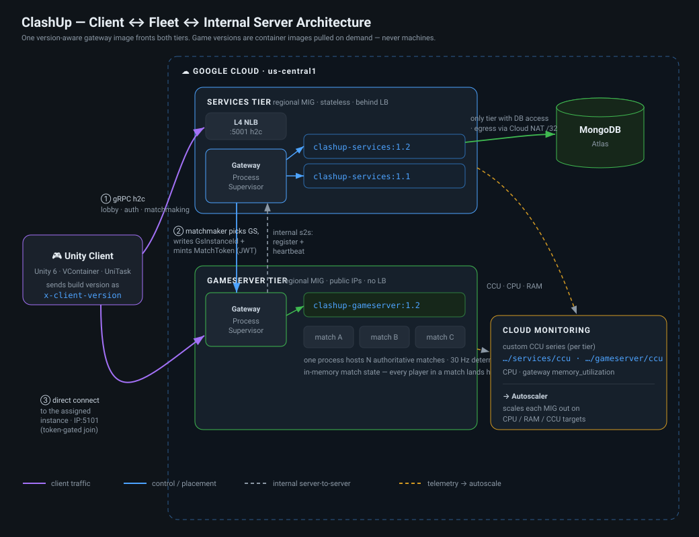
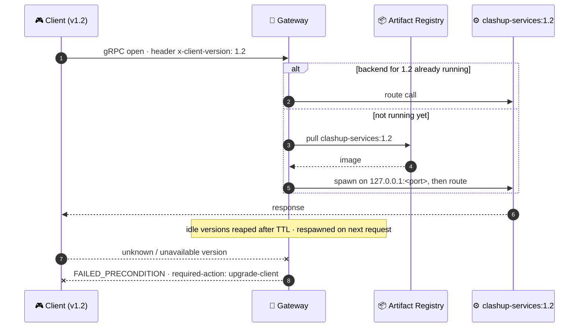
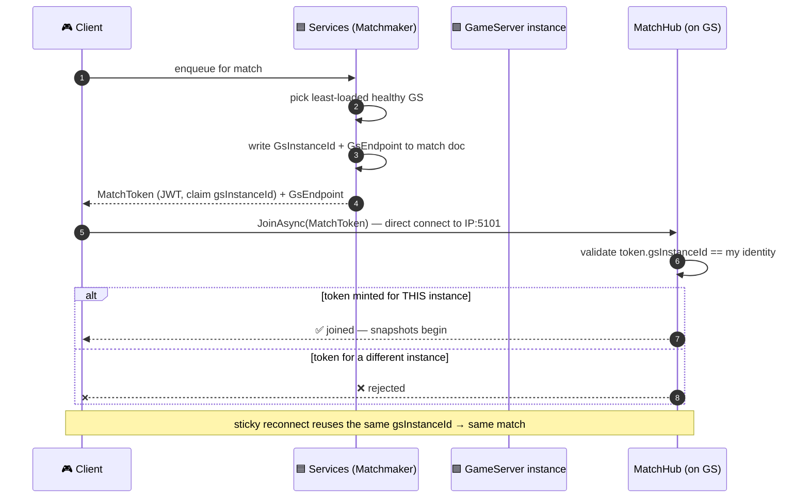
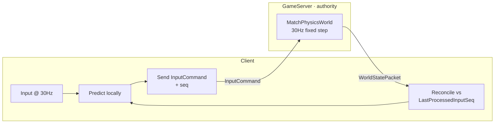
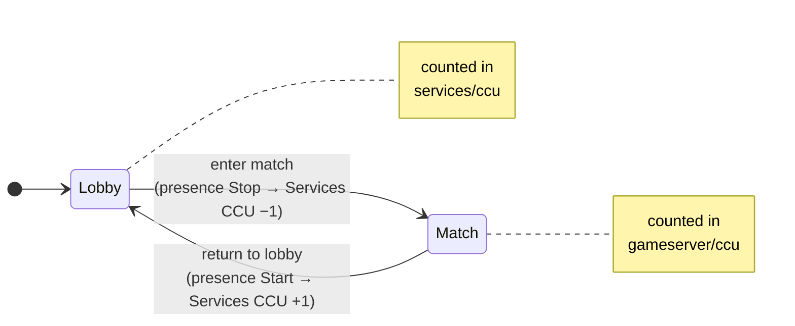
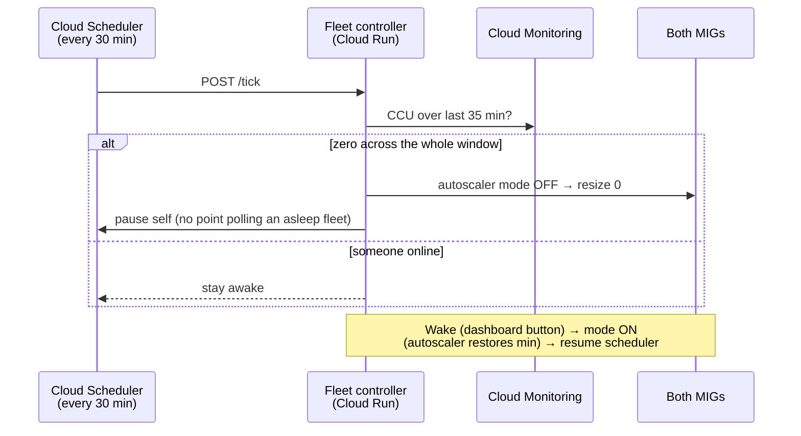
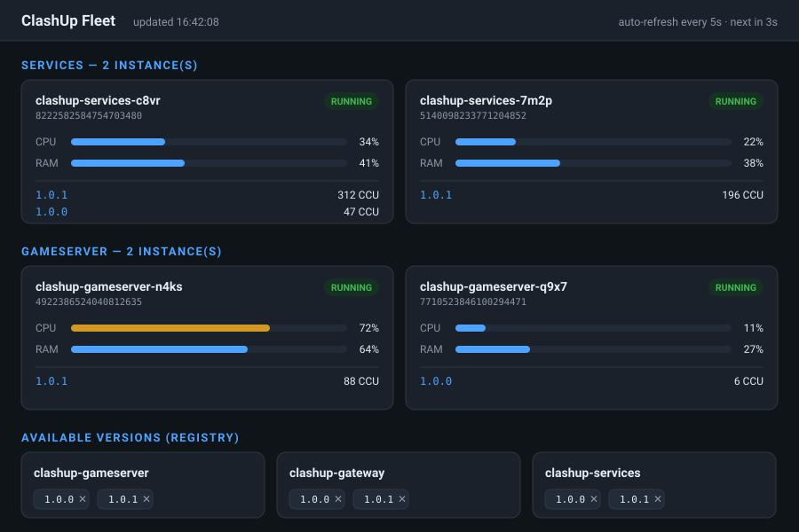

<div align="center">

# ⚔️ ClashUp

### A real-time multiplayer arena game — Unity client, server-authoritative C# backend, deployed on GCP as an autoscaling, **version-aware** fleet.

<br/>


</div>

---

## 📑 Table of contents

| | | | |
|---|---|---|---|
| [🎯 Core principles](#-core-principles) | [🗺️ Architecture at a glance](#️-architecture-at-a-glance) | [🚪 Version-aware gateway](#-the-version-aware-gateway) | [🎯 Match → instance routing](#-match--instance-routing) |
| [🔌 Internal server-to-server](#-internal-server-to-server) | [🕹️ Netcode & physics](#️-netcode--physics) | [📈 Autoscaling & CCU](#-autoscaling--ccu) | [📊 Fleet dashboard](#-fleet-dashboard) |
| [🗂️ Repo layout](#️-repo-layout) | [💻 Local development](#-local-development) | [🚀 Deployment (GCP)](#-deployment-gcp) | [🔐 Configuration & security](#-configuration--security) |

---

## 🎯 Core principles

> Three rules that explain almost every design decision in this repo.

- **🛡️ Server-authoritative.** The server is the single source of truth for all game state. Match start/end, scoring, damage, respawns — all decided server-side.
- **🪶 Dumb client.** The client is a thin display layer. It renders what the server tells it and **never** synthesizes authoritative state (e.g. it never decides a match ended — it waits for the server's `OnMatchEnded`).
- **📦 Versions are processes, not machines.** A game version is a *container image*, not a dedicated VM. **One fleet serves every live client version simultaneously.**

---

## 🗺️ Architecture at a glance

<div align="center">



</div>

Two server tiers, each a **regional Managed Instance Group** of identical **gateway** instances running on Container-Optimized OS:

| Tier | Project | Role | Talks to DB? | Reached via |
|------|---------|------|:---:|-------------|
| **🟦 Services** | [`ClashUp.Services`](src/Server/ClashUp.Services) | Everything *outside* a match: auth, profile, lobby, matchmaking, GS registry, config | ✅ **only tier** | Load balancer |
| **🟩 GameServer** | [`ClashUp.GameServer`](src/Server/ClashUp.GameServer) | Runs N concurrent authoritative matches per process | ❌ never | **Direct** public IP after matchmaking |

<details>
<summary><b>Supporting projects</b></summary>

- **[`ClashUp.Server.Common`](src/Server/ClashUp.Server.Common)** — shared server library: JWT auth, Mongo context, GCE metadata helpers, interceptors, and the reusable **CCU reporting** infrastructure (`Ccu/` — `ICcuSource`, `GraceCcuCounter`, `CcuMetricReporter`).
- **[`ClashUp.Gateway`](src/Server/ClashUp.Gateway)** — the version-aware reverse proxy that fronts **both** tiers (same image, different config).
- **[`ClashUp.Shared`](src/Shared/ClashUp.Shared)** — cross-tier wire contracts (hubs, MessagePack DTOs), also consumed by the Unity client as a local package.

</details>

---

## 🚪 The version-aware gateway

Every fleet instance runs **one gateway container** (`ClashUp.Gateway`, `--network host`). The gateway holds **no game logic** — it is a reverse proxy + process supervisor that pulls and runs the exact backend image a client asks for.



**Why this matters**

- **🚢 Shipping a game version = pushing its image.** Tag `v1.3.0` → CI builds and pushes `clashup-{services,gameserver,gateway}:1.3.0`. No infra change — the running fleet serves it the moment a `1.3.0` client connects.
- **🧱 Only a new *gateway* build needs Terraform** (`-var gateway_image_version=<v>`), because the gateway image is baked into the instance template. Game-version images are never named in Terraform.
- **🌈 One fleet hosts all live versions at once** — a staged client rollout needs no parallel infrastructure.

---

## 🎯 Match → instance routing

A GameServer instance holds all of a match's state **in memory**, so **every player in a match must land on the same instance.** The chain that guarantees it:



The instance learns its own public address at boot: the startup script reads the external IP from the **GCE metadata server** and passes it to the backend as `GameServer__PublicEndpoint`, so the address it registers is the one clients can actually reach.

---

## 🔌 Internal server-to-server

The GameServer tier never touches the database — it relies on the Services tier for identity and match records, over **plain gRPC between gateways**.

- **Registration & heartbeat.** Each GameServer *backend* registers its instance with Services at startup and heartbeats periodically (`GameServerRegistrar` + heartbeat service). This is what lets the matchmaker place a match on it.
- **Header-less routing.** Server-to-server calls carry no `x-client-version`, so the gateway routes them to its **`DefaultVersion=latest`** backend.
- **Prewarm (GameServer only).** Because registration lives *inside* a backend, but backends are spawned on demand, a fresh GS instance would never register — a bootstrap deadlock. So the GameServer gateway **prewarms the single newest published version** at boot, which registers the instance and makes it immediately matchable. Services has no such need (its backends spawn from the client's own connection).

> 🔁 **Version transitions:** pushing a new image doesn't kill running backends. A new-version client gets its **own** on-demand backend alongside the old one; the old one idle-evicts (`IdleVersionTtlMinutes`) once its version goes unused. Details in [`deployment-architecture.md`](.claude/memory/deployment-architecture.md).

---

## 🕹️ Netcode & physics

Authoritative simulation on the server, predicted on the client — the classic [Gambetta](https://www.gabrielgambetta.com/client-server-game-architecture.html) model.

| Concern | Approach |
|---------|----------|
| **Physics** | **AetherNet** (deterministic 2D over a Box2D port). The same `MatchPhysicsWorld` runs on server (authority) and client (prediction). |
| **Local player** | Client-side prediction + server reconciliation keyed by `LastProcessedInputSeq`; sub-tick interpolation between 30 Hz fixed steps. |
| **Remote players** | Pure entity interpolation from buffered snapshots, rendered ~66 ms in the past — *not* run through the local physics world. |
| **Wire protocol** | `InputCommand` up; `SnapshotPacket → WorldStatePacket → PlayerStateDto` down. |



> Deeper notes live in [`docs/`](docs/) and the project memory files (`netcode-architecture.md`).

---

## 📈 Autoscaling & CCU

Each MIG autoscales on three signals, and **each tier reports its own CCU**:

| Signal | Source | Services target | GameServer target |
|--------|--------|:---:|:---:|
| **CPU** | native | 80% | 80% |
| **RAM** | gateway's `HostMetricsReporter` → `custom.googleapis.com/instance/memory_utilization` | 80% | 80% |
| **CCU** | per-tier `CcuMetricReporter` | `…/services/ccu` · 500/inst | `…/gameserver/ccu` · 100/inst |

### Mutually-exclusive CCU model

A player is counted in **exactly one tier at a time** — Services while in the lobby/matchmaking, GameServer while in a match:



CCU is implemented once in [`ClashUp.Server.Common/Ccu/`](src/Server/ClashUp.Server.Common):

- **`GraceCcuCounter`** — thread-safe counter with a disconnect grace window (a quick reconnect stays counted).
- **`CcuMetricReporter`** — `BackgroundService` pushing an `ICcuSource`'s count to Cloud Monitoring under a tier-supplied metric type, labelled by server version. No-ops off-GCE.
- On the client, **`ServicesPresence`** holds a keepalive Services connection while in the lobby and drops it on match entry — that's what flips a player between the two CCU series.

> No Ops Agent required — the gateway self-reports host memory, so instances run on the minimal Container-Optimized OS image.

### Idle auto-sleep (scale to zero)

A GCP MIG autoscaler can't go below 1, so two `e2-small` boxes would idle 24/7 (~$25/mo). A tiny **Cloud Run controller** ([`src/Tools/ClashUp.FleetController`](src/Tools/ClashUp.FleetController)) drives both tiers to **0** when nobody's online and back up on demand — and it scales to zero itself, so it costs ~nothing.



- **Sleep** = autoscaler `mode=OFF` **then** resize to 0. **Wake** = `mode=ON` only — the autoscaler restores `min_replicas` itself (you can't manually resize an autoscaled MIG).
- The **35-min lookback** (longer than the 30-min cadence) is hysteresis: a between-matches dip can't trigger sleep.
- **Tradeoff:** both tiers sleep, so a fully-asleep fleet can't auto-wake a player — waking is manual (the dashboard button below). Ideal for pre-launch; keep Services at `min 1` as a doorman if you ever need self-serve wake.

---

## 📊 Fleet dashboard

A local, **read-only** ASP.NET dashboard ([`src/Tools/ClashUp.Dashboard`](src/Tools/ClashUp.Dashboard)) — per tier and instance: which versions are running, **CCU broken down by server version**, CPU & RAM, and the image tags available in Artifact Registry (with one-click registry cleanup). It also shows a live **next idle-check countdown** while the fleet is awake, and a 💤 **FLEET ASLEEP** banner with a **Wake** button once it has slept (the only write action — it just calls the controller via `run.invoker`; no compute rights live on your machine).

<div align="center">



<sub><i>Live view: two tiers, per-instance CPU/RAM, per-version CCU, and the Artifact Registry tags. The <code>latest</code> tag is intentionally hidden (it only backs header-less routing). Auto-refreshes every 5 s.</i></sub>

</div>

```sh
dotnet run --project src/Tools/ClashUp.Dashboard   # needs read-only dashboard-sa.json → http://localhost:8080
```

> Data sources: Compute Engine (instances/state), Cloud Monitoring (per-tier CCU, CPU, RAM), Artifact Registry (image tags). If a query fails (e.g. an API not yet enabled) the page shows a banner and still renders what it could fetch.

---

## 🗂️ Repo layout

```
src/
  Shared/ClashUp.Shared/          # cross-tier wire contracts; dual-built for .NET + Unity
  Server/
    ClashUp.Server.Common/        # shared server lib (auth, Mongo, GCE, CCU reporting)
    ClashUp.Gateway/              # version-aware reverse proxy + process supervisor
    ClashUp.Services/             # Services tier (auth, lobby, matchmaking, registry)
    ClashUp.GameServer/           # per-match authoritative tier
    ClashUp.Server.sln            # server-only solution
  Tools/
    ClashUp.Dashboard/            # local read-only fleet dashboard (+ Wake button)
    ClashUp.FleetController/      # Cloud Run idle-sleep/wake controller
client/
  ClashUp.Unity/                  # Unity 6 project
external/
  AetherNet/                      # internal physics package (gitignored clone)
ops/
  docker/                         # Dockerfiles + compose (mongo, services, gameserver, gateway)
  terraform/                      # GCP infrastructure (see ops/terraform/README.md)
.github/workflows/                # server-ci / server-cd / server-dev / fleet-controller
docs/
  GDD.md, rules/, assets/         # design doc + contributor rules + README diagrams
ClashUp.sln                       # full solution (server + Shared)
```

---

## 💻 Local development

**Prerequisites:** .NET 8 SDK (`global.json` pins the version), Docker, Unity 6 LTS (`6000.0.x`).

```sh
# Local Mongo
docker compose -f ops/docker/mongo.compose.yml up -d

# Build everything
dotnet build ClashUp.sln

# Run the tiers (separate terminals)
dotnet run --project src/Server/ClashUp.Services      # :5001 gRPC, :9001 admin
dotnet run --project src/Server/ClashUp.GameServer    # :5101 gRPC, :9101 admin

# …or the whole stack (mongo + both tiers behind gateways) in containers:
docker compose -f ops/docker/docker-compose.yml up --build

# Unity client: open client/ClashUp.Unity in Unity 6 LTS.
```

Off-GCE, all cloud integrations **degrade gracefully**: GCE metadata helpers return null, CCU reporting disables itself, and public-endpoint resolution falls back to the configured value. You can run and play locally with nothing but Mongo.

> 📱 **Phone / device testing** uses Tailscale or `adb reverse` — see `dev-environment.md` and `EnvironmentConfig` in the Unity client.

---

## 🚀 Deployment (GCP)

Full runbook: **[`ops/terraform/README.md`](ops/terraform/README.md)**.

```mermaid
flowchart TD
    PR[Pull request] -->|server-ci.yml| CI[Build + test]
    MAIN[push to main] -->|server-dev.yml| DEV["push :latest<br/>(VERSION=0.0.0-dev)"]
    TAG["git tag v1.3.0"] -->|server-cd.yml| REL["build + push<br/>clashup-*:1.3.0 + :latest"]
    REL --> AR[(Artifact Registry)]
    DEV --> AR
    AR -->|pulled on demand by| FLEET[🚪 Gateways on the fleet]
    style TAG fill:#16271a,stroke:#3fb950
    style REL fill:#16271a,stroke:#3fb950
```



**Bring-up, in short:**

1. **One-time bootstrap** — enable APIs, state bucket, **Workload Identity Federation** for keyless CI, a read-only dashboard SA, and GitHub repo vars/secrets.
2. **Two-phase apply** (instances pull the gateway image at boot):
   - **Phase 1:** registry + network + NAT + instance SA → push first images → allowlist the NAT IP in Atlas.
   - **Phase 2:** MIGs, load balancer, autoscalers, monitoring descriptors.
3. Point the Unity client's Services URL at `terraform output services_endpoint` and set its Bundle Version to a pushed image tag so `x-client-version` matches.

**CI/CD** (`.github/workflows/`): `server-ci.yml` (PR build/test) · `server-cd.yml` (tag `v*.*.*` → versioned release, the real release path) · `server-dev.yml` (push to main → `:latest` dev build).

**Transport:** the Services LB defaults to an external **passthrough Network LB (L4/TCP)** carrying cleartext h2c gRPC — fine for bring-up. Set `services_domain` to switch to an **HTTPS Application LB** with a Google-managed certificate.

---

## 🔐 Configuration & security

<details open>
<summary><b>Configuration</b></summary>

- **Server config** is environment-driven (`Mongo__ConnectionString`, `Jwt__EndUserSigningKey`, `Jwt__InterTierSigningKey`, `GameServer__ServicesEndpoint`, …). In the fleet these are injected into version containers by the gateway via `Gateway__BackendEnvironment__N`, set by the instance startup script from Terraform variables.
- **Package versions** live in two universes that move in lockstep: server NuGet via Central Package Management (`Directory.Packages.props`); Unity via NuGetForUnity + UPM (`Packages/manifest.json`).

</details>

<details open>
<summary><b>Security</b></summary>

- **🔒 Database access is locked to one IP.** Only the Services tier connects to MongoDB, and it has **no external IP** — its egress to Atlas is NATed through a single reserved static IP. So the **Atlas IP-access list contains only the NAT IP as a `/32`** (`terraform output nat_ip`) — **never `0.0.0.0/0`**.
- **🔑 JWT keys are real secrets** supplied via gitignored `terraform.tfvars` (prefer `TF_VAR_*` env or Secret Manager for real deployments) — never committed.
- **🌐 Plaintext bring-up vs TLS.** The default L4 NLB exposes gRPC (including JWTs) in cleartext — acceptable for bring-up only. Flip to TLS via `services_domain` before real players. GameServer match traffic is plaintext h2c by design (direct, low-latency, ephemeral IPs); hardening it is a separate follow-up.
- **🚫 No public SSH** — instances are reached via Identity-Aware Proxy only.

</details>

---

## 📚 Further reading

- [`docs/rules/`](docs/rules/) — contributor rules (read first).
- [`docs/GDD.md`](docs/GDD.md) — game design doc.
- [`ops/terraform/README.md`](ops/terraform/README.md) — full infra runbook.
- [`src/Tools/ClashUp.Dashboard/README.md`](src/Tools/ClashUp.Dashboard/README.md) — dashboard setup.

<div align="center"><sub>Built with Unity 6, .NET 8, MagicOnion, and Terraform · server-authoritative · one fleet, every version.</sub></div>
